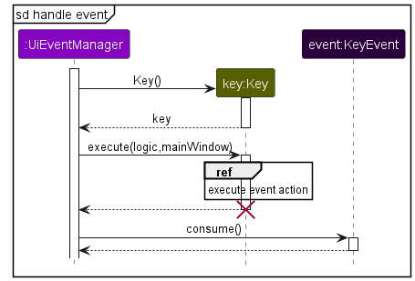
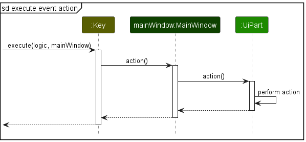
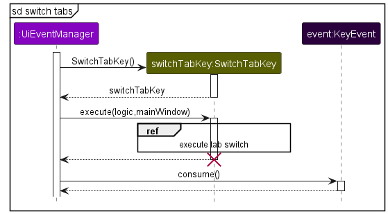
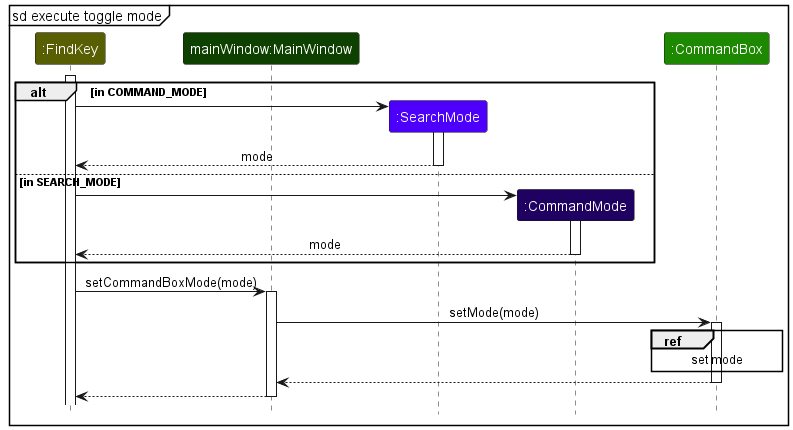
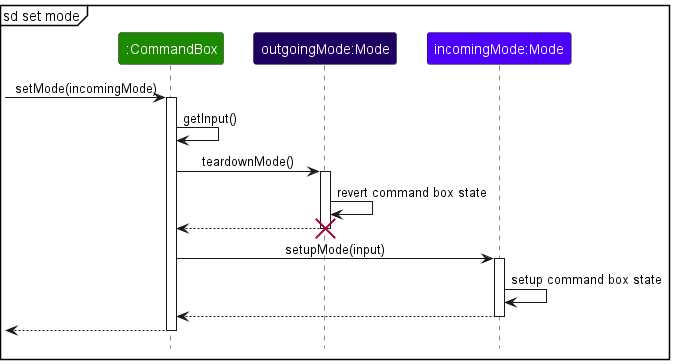
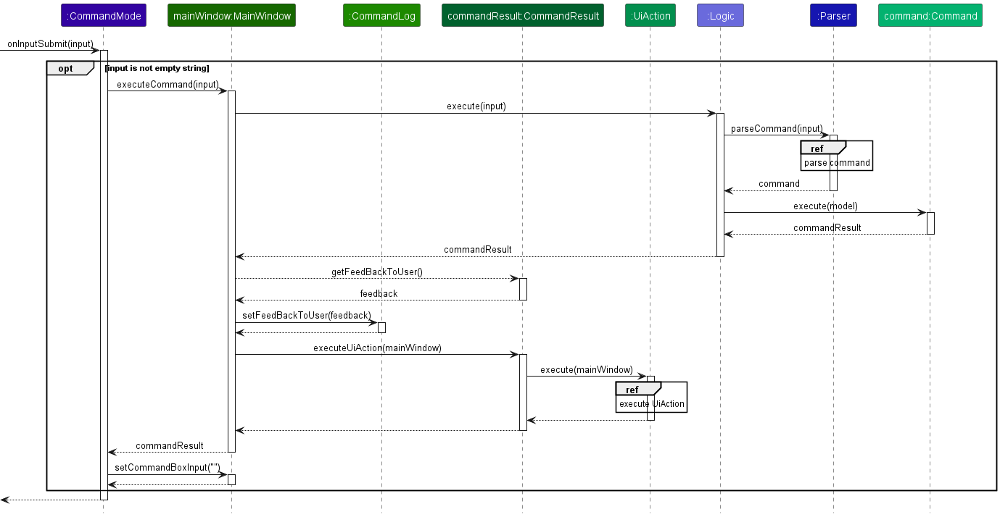

## Table of Contents

* Table of Contents
{:toc}

--------------------------------------------------------------------------------------------------------------------

## Acknowledgements

* Libraries used: [JavaFX](https://openjfx.io/),
  [Jackson](https://github.com/FasterXML/jackson),
  [JUnit5](https://github.com/junit-team/junit5)
* With inspiration from: [fzf](https://github.com/junegunn/fzf) (for fuzzy
  finding), [Vim](https://www.vim.org/) (for hotkeys)
* Originally forked from: [AddressBook
  3](https://github.com/nus-cs2103-AY2223S2/tp)

## Using this Guide

This guide is written for anyone who wishes to hack on the Mycelium codebase.
It assumes basic knowledge of Java as well as the ability to read UML diagrams.

### Icons and conventions

The following typographical conventions are used in this guide.

* (KEYCAP) - Indicates a literal set of keys, e.g. (CTRL+F) refers to the
  combination of the 'Control' and 'F' keys.

Throughout this guide, you might encounter certain boxes which like the ones
below. Here is what each of them means.

:bulb: This box signifies a tip or suggestion.

:information_source: This box signifies a general note.

:warning: This box indicates a warning or caution.

--------------------------------------------------------------------------------------------------------------------

## Setting Up, Getting Started

### Cloning the repo

First, fork [the repo](https://github.com/AY2223S2-CS2103T-W14-1/tp), and clone
the fork into your local machine.

If you plan to use Intellij IDEA:

1. **Configure the JDK**: Follow the guide [_[se-edu/guides] IDEA: Configuring
   the JDK_](https://se-education.org/guides/tutorials/intellijJdk.html) to to
   ensure Intellij is configured to use **JDK 11**.
1. **Import the project as a Gradle project**: Follow the guide
   [_[se-edu/guides] IDEA: Importing a Gradle
   project_](https://se-education.org/guides/tutorials/intellijImportGradleProject.html)
   to import the project into IDEA.  :information_source: Note: Importing a Gradle
   project is slightly different from importing a normal Java project.

If you plan to use other development environments, please seek out the
appropriate guides on setting up JDK 11 and Gradle.

Now, assuming you have successfully set up the project, let us verify that the
code works as intended. In a terminal, navigate to the directory where you
cloned the repo and execute the following command: `./gradlew test`. This will
run all of Mycelium's automated tests. If you don't see any error messages
printed, then you're all set.

:bulb: Did `./gradlew test` not work for you? Depending on your operating
system and shell, there might be different ways to run the Gradle wrapper file.
We advise you to

1. Check that the file has execute permissions
1. Check [Gradle's
   website](https://docs.gradle.org/current/userguide/gradle_wrapper.html#sec:using_wrapper)
   for more information

### Before writing code

1. **Configure the coding style**

   If using IDEA, follow the guide [_[se-edu/guides] IDEA: Configuring the code
   style_](https://se-education.org/guides/tutorials/intellijCodeStyle.html) to
   set up IDEA's coding style to match ours.

1. **Set up CI**

   This project comes with a GitHub Actions config files (in
   `.github/workflows` folder). When GitHub detects those files, it will run
   the CI for your project automatically at each push to the `master` branch or
   to any PR. No set up required.

1. **Learn the design**

   When you are ready to start coding, we recommend that you get some sense of
   the overall design by reading about [Mycelium’s
   architecture](#architecture).

--------------------------------------------------------------------------------------------------------------------

## Design

### Architecture

@doug (all the misc todos here)

{TODO drawio}

The ***Architecture Diagram*** given above explains the high-level design of the App.

Given below is a quick overview of main components and how they interact with each other.

**Main components of the architecture**

{TODO update link}
**`Main`** has two classes called [`Main`](https://github.com/se-edu/addressbook-level3/tree/master/src/main/java/seedu/address/Main.java) and [`MainApp`](https://github.com/se-edu/addressbook-level3/tree/master/src/main/java/seedu/address/MainApp.java). It is responsible for,
* At app launch: Initializes the components in the correct sequence, and connects them up with each other.
* At shut down: Shuts down the components and invokes cleanup methods where necessary.

[**`Commons`**](#common-classes) represents a collection of classes used by multiple other components.

The rest of the App consists of four components.

* [**`UI`**](#ui-component): The UI of the App.
* [**`Logic`**](#logic-component): The command executor.
* [**`Model`**](#model-component): Holds the data of the App in memory.
* [**`Storage`**](#storage-component): Reads data from, and writes data to, the hard disk.

**How the architecture components interact with each other**

{TODO update the description and diagram here}

Each of the four main components (also shown in the diagram above),

* defines its *API* in an `interface` with the same name as the Component.
* implements its functionality using a concrete `{Component Name}Manager` class (which follows the corresponding API `interface` mentioned in the previous point.

For example, the `Logic` component defines its API in the `Logic.java` interface and implements its functionality using the `LogicManager.java` class which follows the `Logic` interface. Other components interact with a given component through its interface rather than the concrete class (reason: to prevent outside component's being coupled to the implementation of a component), as illustrated in the (partial) class diagram below.

The sections below give more details of each component.

### UI component

{TODO update link}
The **API** of this component is specified in [`Ui.java`](https://github.com/se-edu/addressbook-level3/tree/master/src/main/java/seedu/address/ui/Ui.java)

{TODO update diagram}

### Logic component

{TODO update link}
**API** : [`Logic.java`](https://github.com/se-edu/addressbook-level3/tree/master/src/main/java/seedu/address/logic/Logic.java)

Here's a (partial) class diagram of the `Logic` component:

How the `Logic` component works:
1. When `Logic` is called upon to execute a command, it uses the `AddressBookParser` class to parse the user command.
1. This results in a `Command` object (more precisely, an object of one of its subclasses e.g., `AddProjectCommand`) which is executed by the `LogicManager`.
1. The command can communicate with the `Model` when it is executed (e.g. to add a project).
1. The result of the command execution is encapsulated as a `CommandResult` object which is returned back from `Logic`.

The Sequence Diagram below illustrates the interactions within the `Logic` component for the `execute("dp -pn Mycelium")` API call.

:information_source: **Note:** The lifeline for `DeleteProjectCommandParser` should end at the destroy marker (X) but due to a limitation of PlantUML, the lifeline reaches the end of diagram.

Here are the other classes in `Logic` (omitted from the class diagram above) that are used for parsing a user command:

How the parsing works:
* When called upon to parse a user command, the `AddressBookParser` class creates an `XYZCommandParser` (`XYZ` is a placeholder for the specific command name e.g., `AddProjectCommandParser`) which uses the other classes shown above to parse the user command and create a `XYZCommand` object (e.g., `AddProjectCommand`) which the `AddressBookParser` returns back as a `Command` object.
* All `XYZCommandParser` classes (e.g., `AddProjectCommandParser`, `DeleteProjectCommandParser`, ...) inherit from the `Parser` interface so that they can be treated similarly where possible e.g, during testing.

### Model component

### Smaller components used by Model component

***Classes:*** [`Client.java`](https://github.com/AY2223S2-CS2103T-W14-1/tp/blob/master/src/main/java/mycelium/mycelium/model/client/Client.java), [`Project.java`](https://github.com/AY2223S2-CS2103T-W14-1/tp/blob/master/src/main/java/mycelium/mycelium/model/client/Client.java)

{TODO update diagram}

The `Model` box is the central component of the Mycelium's data. It contains
the entities `Client` and `Project` which are used to store the data of each
entity.

The `Client` class contains the attributes for a client's `Name`, `Email`,
`YearOfBirth`, source and `Phone` number, where the name and email are
compulsory fields. The rest of the attributes are optional, and hence stored in
`Optional` objects. The source attribute is a `String`.

The `Project` class contains the attributes for a project's `Name`,
`ProjectStatus`, `Email`, source, description, acceptedOn and deadline, where
the project name and email are compulsory fields. The rest of the attributes
are optional, where source, description and deadline are wrapped in `Optional`
objects. These optional attributes are typed:

- source: String
- projectStatus: `ProjectStatus`
- description: String
- acceptedOn: `LocalDate`
- deadline: `LocalDate`

Each entity uses different methods, which they inherit from `ClientModel` and
`ProjectModel` interface via the `Model` interface respectively.

Moreover, each entity is also stored in a `UniqueList`, which ensures that the
list do not contain duplicates. `UniqueList` from each entity is then stored in
`AddressBook`, which contains the overarching methods for handling each type of
list.

### Storage component

{TODO update diagram and link}
**API** : [`Storage.java`](https://github.com/se-edu/addressbook-level3/tree/master/src/main/java/seedu/address/storage/Storage.java)

The `Storage` component,
* can save both address book data and user preference data in json format, and read them back into corresponding objects.
* inherits from both `AddressBookStorage` and `UserPrefStorage`, which means it can be treated as either one (if only the functionality of only one is needed).
* depends on some classes in the `Model` component (because the `Storage` component's job is to save/retrieve objects that belong to the `Model`)

### Common classes

Classes used by multiple components are in the `mycelium.mycelium.commons` package.

--------------------------------------------------------------------------------------------------------------------

:information_source: The following three sections discuss implementation
details. We have divided them into three overarching themes: [User
Interface](#user-interface), [Command Handling](#command-handling), and
[Keyboard Interactions](#keyboard-interactions).

## User Interface

### Statistics Dashboard

Statistics Dashboard displays statistics regarding Projects. There are three
main statistics: projects that are due within one week, projects that are overdue
and a pie chart showing progress overview. The goal of this feature is to provide users
with useful information related to productivity to make adjustments accordingly.

For projects that are due within one week, only top three projects that match the
condition will be displayed to ensure that users can focus on the most urgent projects.

For overdue list, all overdue projects will be displayed to make sure that users can
keep track of all the deadlines they have missed.

For progress overview pie chart, there will be at most three segments. The three segments
will correspond to three project statuses, which are `not_started`, `done` and `in_progress`.
The size of each segment is proportional to the number of projects with its corresponding segment
label.

#### Updating the UI

For due project lists, overdue project lists and pie chart, `FilteredList` retrieved by
using `Logic#getFilteredProjectList` cannot be used because it will affect the UI. Besides,
all the statistics need filtering out, making it not possible to use `FilteredList#setPredicate`.
Thus, for the dashboard to update accordingly as changes are made to project list, a `ListChangeListener`
will be attached to the original list of projects. Whenever there is a change in the project list (e.g.
a new project is added), all the statistics will be updated as well.
Moreover, when there are no projects available, there will be messages displayed.

This diagram above shows us that the MainWindow is responsible for instantiating the StatisticsBox.
The fillInnerParts() method is part of the UI's initialization routine. The `ObservableList<Project>#addListener()`
will be called to listen for changes in project list. The remaining methods are not important in this discussion.

{TODO update diagram}

### Tabs panel

## Keyboard Interaction

### Hotkeys with UiEvents

UiEvents is an abstraction of keyboard events that can trigger changes in
user interface or perform some action. These keyboard events are handled by
UiEvent handlers that are bundled together within the `UiEventManager` class.

:information_source: We will occasionally refer to each of these event handlers as a `Key`

The following is the class diagram of the
`UiEventManager` class.

There are currently 10 registered event handlers, namely:
* `HelpKey` Help (F1)
* `QuitKey` Quit (CTRL+Q)
* `StartOfLineKey` Start of Line (CTRL+W)
* `EndOfLineKey` End of Line (CTRL+E)
* `ClearKey` Clear line (CTRL+D)
* `SwitchPanelKey` Switch Panels (CTRL+S)
* `SwitchTabKey` Switch Tabs (CTRL+L)
* `NextItemKey` Select next (CTRL+J)
* `PrevItemKey` Select previous (CTRL+K)
* `FindKey` Search (CTRL+F)

Each of these event handler perform an action associated with a keyboard event.
The action performed by each event handler can be found and modified in their respectively
named files found in the `java/mycelium/mycelium/logic/uievent` folder.

To find out more about the supported keyboard events and its associated actions
in Mycelium, please refer to the [User Guide](UserGuide.md#hotkeys).

#### UiEvent Handling
The `UiEventManager` is responsible for calling the appropriate event handler to handle
the incoming event. When a keyboard input is registered, the `UiEventManager#catchAndExecute(KeyEvent)`
method will be called with the incoming event as the argument.

The above seqeuence diagram shows what happens when a keyboard event is
registered. To keep the diagram simple, we only explicitly show two
out of the 10 registered event handlers as the other event handlers
work in a similar manner.
The key combination that triggered the event will be checked against the
each of the registered event handlers to decide which event handler to invoke.

The above sequence diagram shows what happens once there is a match with a
generic event handler. An instance of the respective `Key` will be created,
and executed. The event is then consumed to prevent the event from propagating
any further to the inner UI elements.

The above sequence diagram shows how the user interface can be modified during
the execution of the `Key` instance. The `Key` calls the respective method of
the `MainWindow` which in turns calls the respective UI component to perform
the action associated with the event.

We will use the `SwitchTabKey` event handler as a concrete example. The following
sequence diagrams show what happens when the `SwitchTabKey` event handler is invoked.

Note that not all event handlers are built the same. An example of a more
complicated event handler will be `FindKey` which we will elaborate more
in the next section.

### Command Box

The command box in Mycelium can be in one of 2 `Mode` of operation, namely, `CommandMode` and `SearchMode`,
and supports switching between these 2 modes.
A `Mode` is modular component that is attached to the command box which
dictates the behaviour of the command box on input change and on submit.

The following is class diagram of the command box.

#### Changing Modes

The user can toggle between `SearchMode` and `CommandMode` with a keyboard event
invoking the `FindKey` event handler. Please refer to the
[UiEvent Handling](#uievent-handling) section for more information of how Mycelium
handles keyboard event.

The following sequence diagrams show what happens when `FindKey` event handler
is invoked.

Depending on the current `Mode` of the command box, triggering the `FindKey` event handler
creates the other `Mode` and calls `MainWindow#setCommandBoxMode(Mode)` which sets `Mode`
of the command box by calling `CommandBox#setMode(Mode)`.

When `Mode#setMode(Mode)` is called, the command box will call `Mode#teardownMode()`
on its outgoing `Mode` to perform the necessary clean up which includes
reverting the input to its prior state. The command box then calls `Mode#setupMode(String)`
on the incoming `Mode` which will perform the necessary setup for the incoming `Mode`.
This includes caching the current input of the command box so that it can return the input
to its original state when incoming `Mode` is torn down in the future.

#### On submit

The following sequence diagram shows what happens when the user submits in the
command box.

When the user submits, the command box will call `Mode#onInputSubmit(String)`
on its current `Mode` with the text input. An `Optional<Mode>` instance will be
returned which indicate the next `Mode` to change to if there is a `Mode`. Otherwise,
it will remain in keep its current `Mode`. This is utilised to switch back the command
box to `CommandMode` when submitting in `SearchMode`.

#### On input change

The following sequence diagram shows what happens when the user edits the input
of the command box.

When the user edits the input, the command box will call `Mode#onInputChange(String)`
on its current `Mode` with the text input. This is utilised in `SearchMode` to allow
for interactive changes to the displayed projects and clients as the user types.

### Fuzzy searching

{TODO fix diagrams}

A fuzzy search searches for text that matches a term closely instead of exactly.
In Mycelium, this is implemented using a modified version of [Levenshtein
distance](https://en.wikipedia.org/wiki/Levenshtein_distance), which measures
the "distance" between two strings. A lower distance corresponds to a better
match; a higher distance corresponds to a worse match. The goal of this feature
is to provide interactive fuzzy searching and display sorted results such that
the best match is at the top; here, "interactive" means that results are ranked
and displayed *as* the user types their query.

:information_source: **Note:** We will use the terms "fuzzy search" and "fuzzy
find" interchangeably in this document. The term "fuzzy ranking" refers to the
entire routine of processing items, computing their Levenshtein distance
against some input, and sorting them such that the closest matches are at the
front.

This section will briefly cover the idea behind the fuzzy ranking algorithm.
For full details regarding how the scoring is done, it is best to refer to [the
code](https://github.com/AY2223S2-CS2103T-W14-1/tp/blob/master/src/main/java/mycelium/mycelium/model/util/Fuzzy.java)
directly.

The scoring algorithm is implemented in the `Fuzzy` class in two pure
functions - `Fuzzy#delta` and `Fuzzy#levenshtein`, both returning a `double`
between 0 and 1 inclusive. A score of 1 indicates a perfect match, and lower
scores indicate poorer matches.

* `Fuzzy#delta` is a simpler algorithm which takes a query string and a target,
  and expects to find the query string as a subsequence of the target. In other
  words, it expects to find every character of the query within the target, and
  in the same order.
* `Fuzzy#levenshtein` computes the Levenshtein distance between two strings,
  and then normalizes it into the range [0, 1].

Suppose we have a query string and a list of items to rank, according to how
well they match the query. In broad strokes, the algorithm proceeds as such:

1. Compute `Fuzzy#delta` for each item.
1. For each item which received a score above zero, sort them by descending
   scores and add them to the resulting list.
1. Compute `Fuzzy#levenshtein` for the *remaining items* only.
1. Repeat step (2) for the remaining items using the scores obtained from
   `Fuzzy#levenshtein`.
1. Return the resulting list.

:bulb: The algorithm outlined above actually filters out all items which
receive a **zero** score from both `Fuzzy#delta` and `Fuzzy#levenshtein`. These
items would subsequently not be displayed to the user. If we raised this number
to, say, 0.1, then we can impose a stricter requirement on how well the items
match any given query, thus potentially filtering out more items. Hence, this
is a point for possible fine-tuning in the future.

#### `FuzzyManager`

In order to use fuzzy search from the application, we also have the
`FuzzyManager` class which exposes a more convenient API for us to rank clients
and projects. The class diagram below shows a high level overview of the
classes involved.

The `FuzzyManager#rankItems` method is just a convenient pure function which,
when given a list of clients or projects and a query string, constructs a new
sorted and filtered list based on how well each item matches the query. It
relies on the algorithm implemented within the `Fuzzy` class.

Note that part of this logic is implemented in the `SearchMode` class, which
has already been mentioned [above](#command-box). The `SearchMode` class
encapsulates the logic required to handle search requests (via a change in user
input) as well as applying updates to the UI. The following sequence diagrams
illustrate this in further detail.

From above, we see that the `onInputChanged()` method on `SearchMode` is
invoked with the current contents of the command box. From here, it is a
three-step process.

1. Retrieve an unmodified view of the clients and projects from a `Logic` instance
1. Pass the two lists through the `FuzzyManager#rankItems` method, which
   performs fuzzy ranking on the lists of clients and projects
1. Apply the two ranked lists to the `MainWindow`

#### `CommandBox` state

The section on the [changing Command Box modes](#changing-modes) introduced the
role of this class in managing state between `SearchMode` and `CommandMode`. We
can now contextualize the differences between these two modes in relation to
fuzzy searching. This is illustrated in the activity diagram below.

#### Updating the UI

From the second sequence diagram above, we see that updates to the UI after
fuzzy ranking is achieved by having `SearchMode` *set* the list of items in
`MainWindow`. This departs from the approach used in our CRUD operations, where
(immutable) references to a `FilteredList` of clients and projects were
obtained upon UI initialization, and any changes such as the creation or
deletion of a client were automatically propagated to the UI with no additional
setters required in our application's code.

However, the inclusion of fuzzy search introduces an important requirement -
*arbitrary filtering and sorting* based on user input. Furthermore, upon the
user exiting fuzzy search mode, we need to revert the user's view of clients
and projects back to the way it was, before fuzzy searching began.

In order to decouple these requirements from the more basic ones of CRUD, we
avoid modifying the original `FilteredList` owned by the UI. The general idea
is to replace the two lists of projects and clients every time the fuzzy
ranking is performed. Thus the fuzzy ranking is free to perform any kind of
sorting and filtering it requires without worrying about any unintentional
side-effects on the UI. After the user exits from fuzzy finding mode, the UI
then retrieves a clean reference to the lists of clients and projects from the
address book, which automatically reverts it to its pre-fuzzy state.

## Command Handling

### Commands

#### Command Sequence

When the command box is in `CommandMode`, the user can enter commands to perform various operations in Mycelium. The following sequence diagram shows how the command is handled.

When the user enters a command, the command box calls `Mode#onInputSubmit(String)` on its current `CommandMode`.
The input from the command box is then propagated down to the `MainWindow`, the `Logic` and finally the `Parser` to be parsed.

The `Parser` then returns a `Command` instance to `Logic` which then executes the `Command` instance. The execution returns a `CommandResult` which is then passed back to the `MainWindow`.

The `MainWindow` updates the `CommandLog` based on the feedback from `CommandResult` and executes the `UiAction`.

The `CommandMode` then clears the `CommandBox` input and is now ready for accepting the next command.

#### UiActions

The `UiAction` class is an abstract class that represents an action to be performed by the `MainWindow`. Every `CommandResult` returned from a `Command` execution contains a `UiAction` that is to be executed by the `MainWindow`.

This is used to perform actions such as switching the tab to Projects tab when a Project related command is executed or exiting the application when the `ExitCommand` is executed.

The following sequence diagram shows how the `UiAction` that switches the tab to Projects tab.

Upon being executed, `UiAction` instance calls the appropriate method in `MainWindow` to perform the action from a successful command. In this case, the `UiAction` calls `MainWindow#selectProjectTab` to switch the tab to the Projects tab.

### Parser

--------------------------------------------------------------------------------------------------------------------

## Testing

@ruby

## DevOps

### Build automation

This project uses Gradle for **build automation and dependency management**.
**You are recommended to read [this Gradle Tutorial from the
se-edu/guides](https://se-education.org/guides/tutorials/gradle.html)**.

Given below are how to use Gradle for some important project tasks.

* **`clean`**: Deletes the files created during the previous build tasks (e.g.
  files in the `build` folder). e.g. `./gradlew clean`

* **`shadowJar`**: Uses the ShadowJar plugin to creat a fat JAR file in the
  `build/lib` folder, *if the current file is outdated*. e.g. `./gradlew shadowJar`.

* **`run`**: Builds and runs the application. 
  **`runShadow`**: Builds the application as a fat JAR, and then runs it.

* **`checkstyleMain`**: Runs the code style check for the main code base. 
  **`checkstyleTest`**: Runs the code style check for the test code base.

* **`test`**: Runs all tests.
  * `./gradlew test` — Runs all tests
  * `./gradlew clean test` — Cleans the project and runs tests

--------------------------------------------------------------------------------------------------------------------

### Continuous integration (CI)

This project uses GitHub Actions for CI. The project comes with the necessary
GitHub Actions configurations files (in the `.github/workflows` folder). No
further setting up required.

#### Code coverage

As part of CI, this project uses Codecov to generate coverage reports. When CI
runs, it will generate code coverage data (based on the tests run by CI) and
upload that data to the CodeCov website, which in turn can provide you more
info about the coverage of your tests.

However, because Codecov is known to run into intermittent problems (e.g.,
report upload fails) due to issues on the Codecov service side, the CI is
configured to pass even if the Codecov task failed. Therefore, developers are
advised to check the code coverage levels periodically and take corrective
actions if the coverage level falls below desired levels.

To enable Codecov for forks of this project, follow the steps given in [this
se-edu guide](https://se-education.org/guides/tutorials/codecov.html).

#### Repository-wide checks

In addition to running Gradle checks, CI includes some repository-wide checks.
Unlike the Gradle checks which only cover files used in the build process,
these repository-wide checks cover all files in the repository. They check for
repository rules which are hard to enforce on development machines such as line
ending requirements.

These checks are implemented as POSIX shell scripts, and thus can only be run
on POSIX-compliant operating systems such as macOS and Linux. To run all checks
locally on these operating systems, execute the following in the repository
root directory:

`./config/travis/run-checks.sh`

Any warnings or errors will be printed out to the console.

**If adding new checks:**

* Checks are implemented as executable `check-*` scripts within the `.github`
  directory. The `run-checks.sh` script will automatically pick up and run
  files named as such. That is, you can add more such files if you need and the
  CI will do the rest.

* Check scripts should print out errors in the format `SEVERITY:FILENAME:LINE:
  MESSAGE`
  * SEVERITY is either ERROR or WARN.
  * FILENAME is the path to the file relative to the current directory.
  * LINE is the line of the file where the error occurred and MESSAGE is the
    message explaining the error.

* Check scripts must exit with a non-zero exit code if any errors occur.

--------------------------------------------------------------------------------------------------------------------

### Making a release

Here are the steps to create a new release.

1. Update the version number in
   [`MainApp.java`](https://github.com/AY2223S2-CS2103T-W14-1/tp/blob/master/src/main/java/mycelium/mycelium/MainApp.java).
1. Generate a fat JAR file using Gradle (i.e., `gradlew shadowJar`).
1. Tag the repo with the version number. e.g. `v0.1`
1. [Create a new release using
   GitHub](https://help.github.com/articles/creating-releases/). Upload the JAR
   file you created.

## Logging

* We are using `java.util.logging` package for logging.
* The `LogsCenter` class is used to manage the logging levels and logging
  destinations.
* The `Logger` for a class can be obtained using `LogsCenter.getLogger(Class)`
  which will log messages according to the specified logging level.
* Log messages are output through the console and to a `.log` file.
* The output logging level can be controlled using the `logLevel` setting in
  the configuration file (See the [Configuration guide](Configuration.md)
  section).
* **When choosing a level for a log message**, follow the conventions given in
  [_[se-edu/guides] Java: Logging
  conventions_](https://se-education.org/guides/conventions/java/logging.html).

## Documentation

**Setting up and maintaining the project website:**

* We use [**Jekyll**](https://jekyllrb.com/) to manage documentation.
* The `docs/` folder is used for documentation.
* To learn how set it up and maintain the project website, follow the guide
  [_[se-edu/guides] **Using Jekyll for project
  documentation**_](https://se-education.org/guides/tutorials/jekyll.html).
* Note these points when adapting the documentation to a different
  project/product:
  * The 'Site-wide settings' section of the page linked above has information
    on how to update site-wide elements such as the top navigation bar.
  * :bulb: In addition to updating content files, you might have to update the
    config files `docs\_config.yml` and `docs\_sass\minima\_base.scss` (which
    contains a reference to `Mycelium` that comes into play when converting
    documentation pages to PDF format).

**Style guidance:**

* Follow the [**_Google developer documentation style
  guide_**](https://developers.google.com/style).
* Also relevant is the [_[se-edu/guides] **Markdown coding
  standard**_](https://se-education.org/guides/conventions/markdown.html)

**Diagrams:**

We use both [draw.io](https://app.diagrams.net/) and
[PlantUML](https://plantuml.com/) as diagramming tools. The former is a drag
and drop editor, while the latter defines UML diagrams through plain text
files.

* The `docs/images` directory contains ready-for-use pictures in PNG format
* The `docs/diagrams` directory contains `.puml` files (for PlantUML) and
  `.xml` files (for draw.io) which allow editing and regenerating of diagrams

--------------------------------------------------------------------------------------------------------------------

## Appendix: Requirements

### Product scope

**Target user profile**:
**Freelance Devs**

Freelance web developers with postings on multiple online marketplaces for digital services (e.g. Fiverr) who want to manage projects and clients easily while tracking their contract terms and hours spent per project.

**Value proposition**:
Mycelium strives to be a one-stop shop for freelance web developers to consolidate projects from multiple sources. Manage descriptive yet concise information about each client, all through an intuitive console-first interface. Mycelium is tailored for the modern web developer, enabling you to build strong and trusted relationships with clients.

### User stories

Priorities: High (must have) - `* * *`, Medium (nice to have) - `* *`, Low (unlikely to have) - `*`

| Priority | As a ...               | I want to ...                                                                                                  | So that ...                                                                          |
|----------|------------------------|----------------------------------------------------------------------------------------------------------------|--------------------------------------------------------------------------------------|
| * * *    | user                   | easily access each project by name for convenience.                                                            |                                                                                      |
| * * *    | user                   | create new projects and contacts.                                                                              |                                                                                      |
| * * *    | user                   | delete projects and contacts I no longer need.                                                                 |                                                                                      |
| * * *    | user                   | use the application on different platforms and operating systems.                                              |                                                                                      |
| *        | new user               | experience an intuitive user-interface. There should be help messages to guide me around the features.         | I can refer to instructions when I forget how to use the App                         |
| *        | user                   | efficiently log information about a new client                                                                 | I minimise the effort and time needed to start a project.                            |
| *        | new user               | login using my GitHub account                                                                                  | it is convenient to login.                                                           |
| *        | new user               | sign up using email and password                                                                               | I can avoid using third party authentication sources, like GitHub or Google.         |
| *        | forgetful user         | be reminded of up coming deadlines                                                                             | I will not miss out any deliverables set by clients.                                 |
| *        | user                   | easily categorise the type of each project I have been working on                                              | it is easier to reflect on in the future and navigate.                               |
| *        | user                   | view statistics related to productivity (which channel I gain most projects, money from)                       | I know which project to put more focus on to earn better money.                      |
| *        | user                   | track my client’s payment status                                                                               | transaction management would be fuss-free.                                           |
| *        | user                   | track my project’s progress                                                                                    | I can provide timely updates to my clients.                                          |
| *        | user                   | track the time I have worked on for each project                                                               | I can ensure I have allocated time for the different projects I am working on.       |
| *        | user                   | easily view all of my freelance job requests from Fiverr and Upwork in one place.                              |                                                                                      |
| *        | user                   | update my availability status for each platform in one place                                                   | I don't miss out on job offers due to scheduling conflicts.                          |
| *        | user                   | store client information, such as contact details and project specifications, in one place                     | I can quickly access it when needed.                                                 |
| *        | user with many clients | easily communicate with clients through the product                                                            | I can streamline my workflow and avoid having to switch between different platforms. |
| *        | user                   | receive notifications when I receive new job offers or when deadlines are approaching                          | I can stay on top of my workload.                                                    |
| *        | user                   | easily generate invoices for each freelance job and track payment status                                       | I can manage my finances more effectively.                                           |
| *        | user                   | easily rate and review clients                                                                                 | I can make informed decisions about which jobs to accept in the future.              |
| *        | user                   | follow the work of other developers                                                                            | I can find opportunities to collaborate.                                             |
| *        | user                   | use the app to estimate the amount of time that I will need for a project                                      | I can determine if I have the capacity to take on new projects.                      |
| *        | user                   | keep in contact with other developers                                                                          | I can work on larger projects efficiently.                                           |
| *        | user                   | update details of existing projects and contacts                                                               | I can keep up with changing requirements of clients.                                 |
| *        | user                   | personalize my contacts                                                                                        | I can know each client better                                                        |
| *        | user                   | export data from the product in different formats, such as CSV or Excel                                        | I can use the information elsewhere.                                                 |
| *        | user                   | securely store confidential information, such as client details                                                | I can keep sensitive information safe.                                               |
| *        | user                   | use the product offline                                                                                        | I can access my information when I don't have an internet connection.                |
| *        | user                   | easily search and filter projects based on specific criteria, such as deadline, client name, or project status | I can quickly find the information I need.                                           |

### Use cases

(For all use cases below, the **System** is the `Mycelium` and the **Actor** is the `user`, unless specified otherwise)

**Use case: Create a project**

**MSS**

1. User enters command and submits details for new project
2. Mycelium creates the project
3. User can view the new project listed in panel

   Use case ends.

**Extensions**

* 1a. Required project details are not provided.
   * 1a1. Mycelium shows an error message.

   Use case resumes at step 1.

* 1b. Some projet details are invalid.
   * 1b1. Mycelium shows an error message.

   Use case resumes at step 1.

**Use case: Create a client**

**MSS**

1. User enters command and submits details for new client
2. Mycelium creates the client
3. User can view the new client listed in panel

   Use case ends.

**Extensions**

* 1a. Required client details are not provided.
   * 1a1. Mycelium shows an error message.

   Use case resumes at step 1.

* 1b. Some project details are invalid.
   * 1b1. Mycelium shows an error message.

   Use case resumes at step 1.

**Use case: Delete a project**

**MSS**

1. User enters command and submits name of project to delete
2. Mycelium deletes the project
3. User can no longer see project listed in panel

   Use case ends.

**Extensions**

* 1a. Project with submitted name does not exist.
   * 1a1. Mycelium shows an error message.

   Use case resumes at step 1.

**Use case: Delete a client**

**MSS**

1. User enters command and submits email of client to delete
2. Mycelium deletes the client
3. User can no longer see client listed in panel

   Use case ends.

**Extensions**

* 1a. Client with submitted email does not exist.
   * 1a1. Mycelium shows an error message.

   Use case resumes at step 1.

### Non-Functional Requirements

1.  Should work on any _mainstream OS_ as long as it has Java `11` or above installed.
1.  Should be able to hold up to 1000 clients without a noticeable sluggishness in performance for typical usage.
1.  Should be able to hold up to 1000 projects without a noticable sluggishness in performance for typical usage.
1.  A user with above average typing speed for regular English text (i.e. not code, not system admin commands) should be able to accomplish most of the tasks faster using commands than using the mouse.
1.  All user operations should complete under 100ms.
1.  Should not lose any work in case the application crashes.
1.  Data persists when the application restarts.

*{More to be added}*

### Glossary

The terms in this glossary are sorted in alphabetical order.

* **Client**: An individual associated with a particular project
* **Console-first Interface**: An interface with interactions primarily through
  text commands
* **Draw.io**: A drag-and-drop diagramming tool. Available at
  [draw.io](https://app.diagrams.net/).
* **Fuzzy search**: A feature to search for items which partially match a query
  rather than exactly
* **PlantUML**: A text-based diagramming tool. See
  [plantuml.com](https://plantuml.com/) for more information.
* **Project**: A freelance software development gig

--------------------------------------------------------------------------------------------------------------------

## Appendix: Instructions for manual testing

{TODO maybe add}

